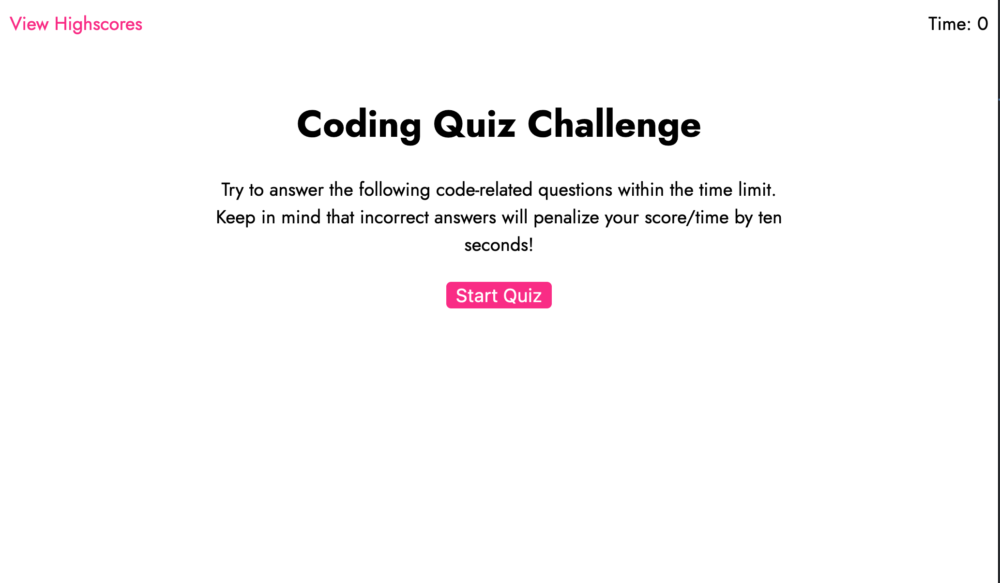
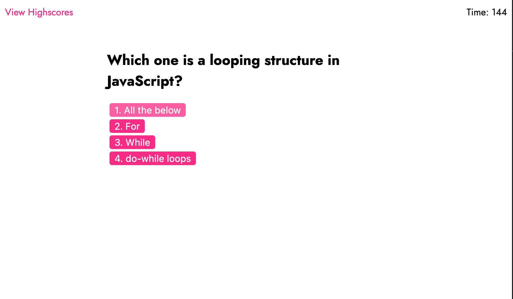
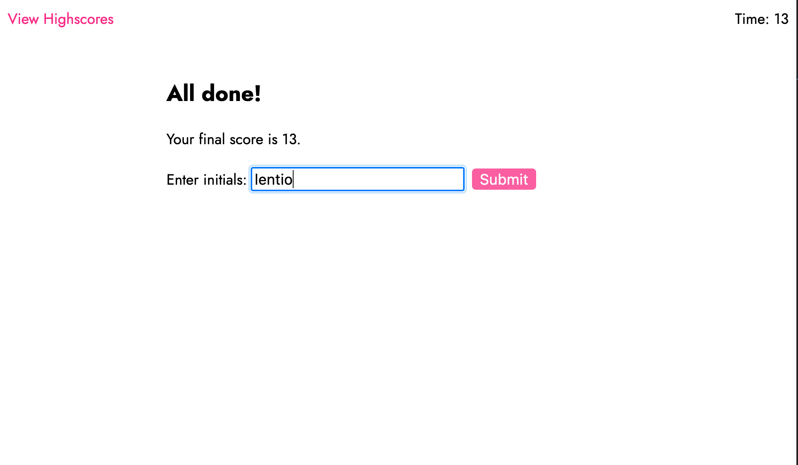
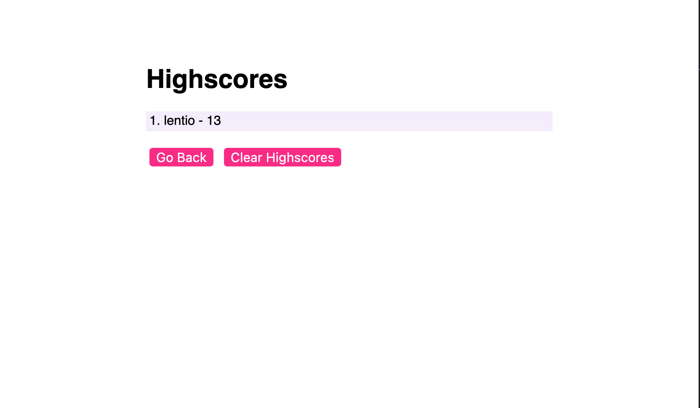

# Coding Quiz

## Coding Quiz description

My project hosts the source code for my JavaScript Coding Quiz Assignment.

### The following imagines demonstrates the application functionality:






## Installing / Getting Started

To test this project, simply clone project into a your local file system and open `index.html` in your favorite browser.

```
git clone git@github.com:lentiodev/Coding-Quiz.git

```

---

## Features

In this JavaScript quiz once you click the start button you will be presented with a series of multiple choice questions and you have only 165 seconds to finish.

## Links

[Deployed link: Try it out!](https://lentiodev.github.io/Coding-Quiz/) </div>

[GitHub link](https://github.com/lentiodev/Coding-Quiz) </div>

## Licensing

"The code in this project is licensed under MIT license."

